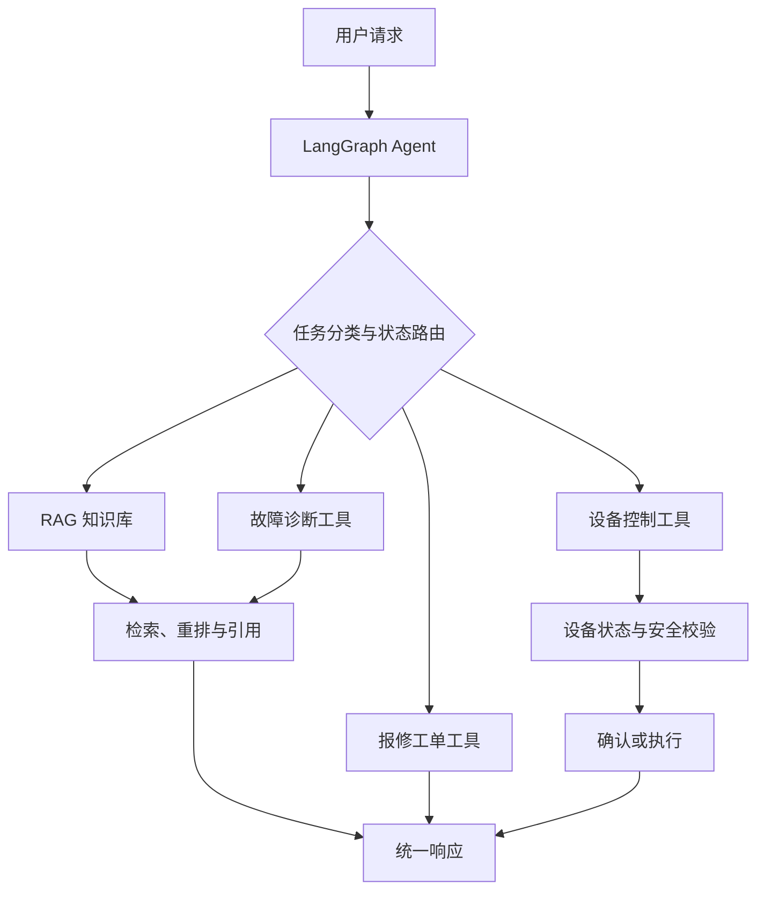

# 智能烹饪设备运维与控制 Agent：12 周学习计划

> 面向 AI Agent / RAG 研发工程师岗位的工程化实战项目。  
> 目标不是简单调用大模型，而是完成一个可测试、可评估、可部署的 AIoT Agent 系统。

## 1. 项目定位

本项目结合智能烹饪设备与 IoT 经验，开发一个“智能烹饪设备运维与控制 Agent”。系统最终应具备以下能力：

- 将中英文自然语言转换为类型安全的设备指令。
- 在执行指令前查询设备状态，并进行业务规则和安全校验。
- 支持多轮澄清、危险操作确认、任务中断与恢复。
- 基于设备说明书和故障知识库回答问题，并提供可靠引用。
- 无法排除故障时，自动收集设备信息并创建报修工单。
- 保存用户设备、使用偏好和历史故障等长期记忆。
- 评估规则解析、LLM 解析和 RAG 的准确率、召回率、延迟与成本。
- 使用 Docker Compose 完成可复现的本地或私有化部署。

## 2. 与目标岗位的对应关系

| 岗位能力 | 本项目中的实践 |
|---|---|
| LLM 调用与结构化输出 | Responses API、Zod Schema、模型适配层 |
| Prompt / Few-shot / 上下文管理 | Prompt 实验、评测集、上下文裁剪与压缩 |
| Agent 任务拆解与规划 | LangGraph 状态图、节点路由、工具编排 |
| Function Calling / 工具调用 | 设备状态、设备控制、诊断、知识库、工单工具 |
| 多轮对话与记忆 | 会话状态、澄清与确认、短期和长期记忆 |
| RAG 全流程 | 文档解析、切片、Embedding、检索、重排、引用 |
| 检索质量优化 | 查询改写、混合检索、Recall@K、MRR、人工评测 |
| 幻觉治理 | 引用约束、证据不足拒答、置信度与回归测试 |
| 工程化部署 | TypeScript、Vitest、PostgreSQL/PgVector、Docker、日志追踪 |
| C/C++ 系统集成 | 通过 HTTP、MQTT 或消息队列对接设备服务 |

## 3. 目标架构



## 4. 技术栈

- **语言与服务端**：Node.js、TypeScript、Express
- **数据校验**：Zod
- **大模型接口**：OpenAI Responses API；通过适配层支持替换为 Qwen、DeepSeek 等模型
- **Agent 编排**：LangGraph.js
- **关系与向量存储**：PostgreSQL、PgVector
- **RAG**：Embedding、混合检索、Reranker、查询改写
- **测试与评测**：Vitest、自定义指令评测集、RAG 回归评测集
- **可观测性**：结构化日志、调用耗时、Token 与成本统计、OpenTelemetry（可选）
- **部署**：Docker、Docker Compose、Linux
- **设备集成**：HTTP、MQTT 或消息队列

> 主项目优先使用 PgVector。FAISS 用于理解本地向量检索原理，Milvus 作为后期对比与扩展内容，不在前期同时铺开。

## 5. 12 周学习路线

### 第 1 周：结构化指令解析与模型适配层

**学习重点**

- TypeScript 工程基础、Zod Schema、判别联合类型。
- 规则解析器与 LLM 解析器的职责边界。
- Responses API、Structured Outputs、Prompt 与 Few-shot。
- 依赖注入、超时、重试、错误分类和 Mock 测试。

**项目产出**

- 类型安全的 `DeviceCommand` 领域模型。
- 支持中英文明确指令的规则解析器。
- 可替换模型供应商的 LLM 适配层。
- 20～30 条中英文指令评测数据。
- 规则解析与 LLM 解析的准确率、延迟和成本对比。

### 第 2 周：Function Calling 与工具抽象

**学习重点**

- Function Calling / Tool Calling 的工作机制。
- 工具输入输出 Schema、错误边界和幂等设计。
- 设备能力与设备状态建模。

**项目产出**

- `get_device_state`：查询设备状态。
- `start_cooking`：启动烹饪。
- `set_temperature`：设置温度。
- `set_timer`：设置计时器。
- `shutdown`：关闭设备。
- 工具注册、Mock 设备网关与自动化测试。

### 第 3 周：LangGraph Agent 与状态调度

**学习重点**

- Agent State、节点、边、条件路由和循环。
- 任务分类、规划、工具选择与执行结果观察。
- 确定性工作流与自主 Agent 的边界。

**项目产出**

- 可运行的设备控制 Agent。
- “理解请求 → 查询状态 → 安全校验 → 调用工具 → 返回结果”完整链路。
- Agent 节点级单元测试和流程测试。

### 第 4 周：多轮对话、安全确认与异常恢复

**学习重点**

- 缺失参数澄清、多轮上下文管理。
- 高风险操作确认与 Human-in-the-loop。
- 超时、重试、重复请求、任务中断和恢复。

**项目产出**

- “启动烤炉但未提供温度”的澄清流程。
- “设备未点火时不能调温”等状态安全规则。
- 关机等危险操作的二次确认。
- 使用 `requestId` 实现幂等控制。
- Agent Checkpoint 和会话恢复测试。

### 第 5 周：知识文档处理管道

**学习重点**

- PDF、Markdown、网页等文档解析。
- 数据清洗、语义切片、重叠窗口和元数据设计。
- 文档版本与增量索引。

**项目产出**

- 设备说明书和故障手册的数据处理脚本。
- 包含设备型号、章节、故障码、页码和版本的元数据。
- 可重复执行、可增量更新的知识入库流程。

### 第 6 周：Embedding、PgVector 与第一版 RAG

**学习重点**

- Embedding、相似度、Top-K 和向量索引基础。
- PostgreSQL 与 PgVector。
- 语义检索、关键词检索和混合检索。

**项目产出**

- Docker Compose 启动 PostgreSQL/PgVector。
- 文档向量化与索引服务。
- 第一版设备故障问答 RAG。
- 回答中返回文档标题、章节或页码引用。

### 第 7 周：检索、重排与上下文优化

**学习重点**

- Query Rewrite、多查询检索和过滤检索。
- BM25 + 向量的混合检索。
- Reranker、上下文去重和上下文压缩。

**项目产出**

- 对设备型号、故障码和固件版本进行元数据过滤。
- 加入重排器并比较前后效果。
- 优化长文档检索和答案冗余问题。

### 第 8 周：RAG 评测与幻觉治理

**学习重点**

- Recall@K、Precision@K、MRR 等检索指标。
- 答案正确性、忠实度、引用覆盖率和延迟评估。
- 证据不足时的拒答策略。

**项目产出**

- 50 条左右的故障问答评测集。
- 自动运行的 RAG 回归测试。
- 基线方案与优化方案的对比报告。
- 无可靠证据时明确拒答，不编造解决方案。

### 第 9 周：短期与长期记忆

**学习重点**

- 对话历史与业务状态的区别。
- 记忆提取、更新、冲突和过期策略。
- 隐私边界与敏感数据最小化。

**项目产出**

- 保存当前会话、未完成任务和确认状态。
- 保存用户设备、常用温度单位、偏好及历史故障。
- 支持“继续上次的排障”等上下文请求。

### 第 10 周：多工具业务 Agent

**学习重点**

- 多工具选择、串行与并行执行。
- 外部 API 失败处理和补偿机制。
- 任务拆解与执行进度管理。

**项目产出**

- 故障诊断工具。
- 知识库检索工具。
- 设备遥测信息查询工具。
- 无法解决时自动整理上下文并创建模拟报修工单。

### 第 11 周：部署、可观测性与性能优化

**学习重点**

- Docker 镜像、Compose、环境变量和健康检查。
- Linux 服务运行与基本排障。
- 日志、Trace、延迟、Token 和成本分析。
- 缓存、限流、超时、重试和并发控制。

**项目产出**

- 一条命令启动 API、Agent 和 PgVector。
- `/health` 与 `/ready` 健康检查。
- 每个 Agent 节点的结构化日志和耗时记录。
- 基础压测结果与主要性能瓶颈分析。

### 第 12 周：模型对比、系统设计与面试材料

**学习重点**

- 不同模型的准确率、延迟和成本权衡。
- LoRA、量化和私有化部署的基础概念。
- Agent、RAG、AIoT 系统设计题。
- STAR 项目表达和故障复盘。

**项目产出**

- GPT、Qwen、DeepSeek 等模型的对比实验（按可用条件选择）。
- 项目架构图、接口文档、评测报告和演示脚本。
- 3～5 分钟项目演示视频或现场演示流程。
- 针对目标岗位的项目介绍和面试问答。

## 6. 第 1 周每日执行计划

前 3 天的内容继续保留，第 4 天开始提高工程要求。

| 天数 | 任务 | 验收结果 |
|---|---|---|
| Day 1 | 初始化 TypeScript 服务，拆分 `app` 与 `server`，实现 `/health` | Typecheck、测试和健康检查通过 |
| Day 2 | 使用 Zod 定义统一设备指令模型 | 合法指令通过，越界和缺参指令被拒绝 |
| Day 3 | 编写中英文确定性规则解析器 | 明确指令无需 LLM 即可稳定解析 |
| Day 4 | 实现可注入的 LLM Provider 接口和 OpenAI 适配器 | 支持 Structured Outputs，Mock 测试通过 |
| Day 5 | 增加超时、重试、错误分类和调用指标 | 可区分鉴权、限流、超时、模型和校验错误 |
| Day 6 | 建立 20～30 条中英文指令评测集 | 可自动统计准确率、延迟和失败原因 |
| Day 7 | 比较规则与 LLM 路由策略并复盘 | 形成第 1 周评测报告和架构说明 |

### 第 4 天的关键调整

LLM 客户端不要直接在业务解析函数中创建，应采用依赖注入：

```typescript
export interface CommandModelProvider {
  parse(input: string, context: ParserContext): Promise<ModelParseResult>;
}
```

这样可以：

- 在单元测试中注入 Mock Provider，避免产生网络依赖和费用。
- 在不同模型之间切换，而不修改领域逻辑。
- 统一处理超时、重试、错误分类、Token 和耗时统计。
- 独立评估模型理解能力与业务安全校验能力。

无论模型是否返回合法结构，最终结果都必须再次经过领域 Schema 和安全规则校验。LLM 只负责语义理解，不能直接执行设备操作，也不能自行生成 `deviceId`、`requestId` 等可信业务字段。

## 7. 建议的项目目录

```text
aiot-device-agent/
├── src/
│   ├── agent/             # LangGraph 状态、节点和路由
│   ├── api/               # HTTP 接口
│   ├── domain/            # 领域模型与安全规则
│   ├── evaluation/        # 指令与 RAG 评测
│   ├── memory/            # 短期和长期记忆
│   ├── observability/     # 日志、指标和 Trace
│   ├── parser/            # 规则解析器与 LLM 解析器
│   ├── providers/         # 模型供应商适配层
│   ├── rag/               # 文档处理、检索和重排
│   ├── tools/             # 设备、诊断、知识库和工单工具
│   ├── app.ts
│   └── server.ts
├── test/                  # 单元测试与流程测试
├── evals/                 # JSONL/JSON 评测数据集
├── docs/                  # 架构、接口和评测报告
├── docker-compose.yml
├── Dockerfile
├── .env.example
└── README.md
```

## 8. 每周固定节奏

适合在职学习的建议安排：

| 时段 | 建议时长 | 内容 |
|---|---:|---|
| 工作日早上 | 15 分钟 | 阅读官方文档，记录 1～2 个关键概念 |
| 工作日中午 | 30 分钟 | 学习课程或分析示例代码 |
| 工作日晚上 | 45～60 分钟 | 编码、测试或评测 |
| 周末 | 2～3 小时 | 集成、复盘、补文档和提交阶段成果 |

每周必须完成一个可以运行和验证的成果，而不是只看课程。建议周末固定回答四个问题：

1. 本周新增了什么可演示能力？
2. 哪些功能有自动化测试或评测数据证明？
3. 当前最大的技术风险是什么？
4. 下周最小可交付成果是什么？

## 9. 阶段验收标准

### 第 4 周结束

- 可以通过多轮对话安全控制模拟设备。
- Agent 会先查询状态，再决定执行、澄清、确认或拒绝。
- 核心节点具备单元测试和流程测试。

### 第 8 周结束

- 可以基于设备说明书回答故障问题并给出引用。
- 有明确的 RAG 评测集和量化指标。
- 对无证据问题能够拒答，避免编造。

### 第 12 周结束

- Docker Compose 可以启动完整系统。
- 可演示设备控制、故障问答和报修工单三条完整链路。
- 有架构文档、接口文档、评测报告、演示流程和面试材料。
- 能说明关键设计选择、失败案例、性能数据和后续优化方向。

## 10. C/C++ 补充范围

岗位正文若仍以 Agent、RAG 和工程落地为主，C/C++ 暂不作为前 8 周主线。恢复到以下程度即可：

- 指针、引用、RAII、智能指针和基本内存管理。
- 线程、互斥锁、条件变量和常见并发问题。
- 阅读并编译 CMake 项目。
- 通过 HTTP、MQTT 或消息队列连接 C++ 设备服务与 Node.js AI 服务。

如果面试确认 Agent 服务本身主要使用 C++，再增加 C++ SDK、并发服务端和推理部署专项训练。

## 11. 学习原则

- **安全优先**：所有设备命令在执行前必须经过 Schema、状态和业务规则校验。
- **评测优先**：Prompt、模型或检索策略的修改必须通过固定评测集验证。
- **工程优先**：每项能力都应具备异常处理、日志和测试，不能只运行一次 Demo。
- **由简到繁**：先完成确定性单 Agent，再考虑多 Agent；先掌握 PgVector，再扩展 Milvus。
- **持续交付**：每周形成可运行代码、测试结果和简短复盘，并提交 Git。

## 12. 最终展示场景

完成 12 周后，应能连续演示以下三个场景：

1. **安全设备控制**：用户要求设置温度，Agent 查询设备状态；设备未点火时拒绝直接调温并引导正确操作。
2. **故障知识问答**：用户提供故障码，Agent 检索对应型号说明书，给出带引用的排查步骤。
3. **自动报修**：知识库方案无效后，Agent 汇总型号、固件、遥测数据、已执行步骤和用户描述，创建模拟工单。

这三个场景共同证明项目不仅“会调用大模型”，还具备 Agent 编排、RAG、工具调用、安全控制、评测和部署能力。
